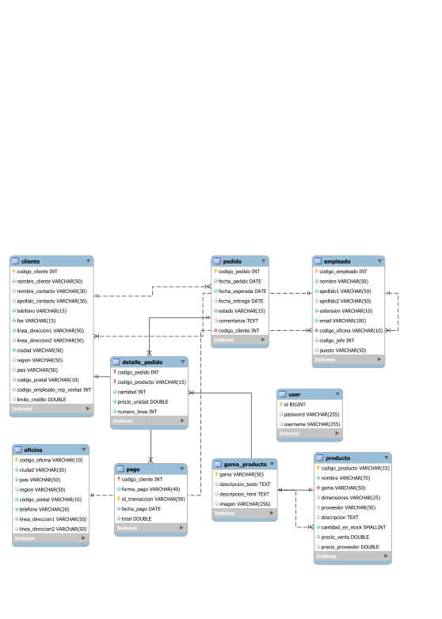

# Documentation Database 'jardineria'

This documentation serves as a fundamental guide for both developers working with the database and end users who rely on it to access and manipulate data effectively. By providing a comprehensive and accurate description of the database, the documentation facilitates maintenance, troubleshooting, and performance optimization.

This document will provide an overview of the database's structure and purpose, along with details about its design, schema, table relationships, stored procedures, and any other relevant components. Additionally, guidelines for proper database usage will be offered, along with tips on best practices and security considerations.

The documentation presented here is designed to be a complete and accessible reference for all parties interested in the database, from developers and administrators to end users. We hope this documentation serves as a useful tool for understanding and making the most of the database in question.

Welcome to the database documentation, your indispensable guide for exploring and managing data effectively!

### This is the database model

<head>
    
</head>
<body>

<em></em>

<h2>Alphabetic Index</h2>
<ul>
<li><a href='#cliente'>cliente</a></li>
<li><a href='#detalle_pedido'>detalle_pedido</a></li>
<li><a href='#empleado'>empleado</a></li>
<li><a href='#gama_producto'>gama_producto</a></li>
<li><a href='#oficina'>oficina</a></li>
<li><a href='#pago'>pago</a></li>
<li><a href='#pedido'>pedido</a></li>
<li><a href='#producto'>producto</a></li>
<li><a href='#user'>user</a></li>
</ul>
<table id='cliente'>
<caption>cliente</caption>
<tr><td colspan='11'></td></tr>
<tr>
    <th>Column name</th>
    <th>DataType</th>
    <th><abbr title='Primary Key'>PK</abbr></th>
    <th><abbr title='Not Null'>NN</abbr></th>
    <th><abbr title='Unique'>UQ</abbr></th>
    <th><abbr title='Binary'>BIN</abbr></th>
    <th><abbr title='Unsigned'>UN</abbr></th>
    <th><abbr title='Zero Fill'>ZF</abbr></th>
    <th><abbr title='Auto Increment'>AI</abbr></th>
    <th>Default</th>
    <th>Comment</th>
</tr>
<tr>
    <td>codigo_cliente</td>
    <td>INT</td>
    <td>&#10004;</td>
    <td>&#10004;</td>
    <td>&nbsp;</td>
    <td>&nbsp;</td>
    <td>&nbsp;</td>
    <td>&nbsp;</td>
    <td class='attr'>&nbsp;</td>
    <td></td>
    <td></td>
</tr>
<tr>
    <td>nombre_cliente</td>
    <td>VARCHAR(50)</td>
    <td>&nbsp;</td>
    <td>&#10004;</td>
    <td>&nbsp;</td>
    <td>&nbsp;</td>
    <td>&nbsp;</td>
    <td>&nbsp;</td>
    <td class='attr'>&nbsp;</td>
    <td></td>
    <td></td>
</tr>
<tr>
    <td>nombre_contacto</td>
    <td>VARCHAR(30)</td>
    <td>&nbsp;</td>
    <td>&nbsp;</td>
    <td>&nbsp;</td>
    <td>&nbsp;</td>
    <td>&nbsp;</td>
    <td>&nbsp;</td>
    <td class='attr'>&nbsp;</td>
    <td>NULL</td>
    <td></td>
</tr>
<tr>
    <td>apellido_contacto</td>
    <td>VARCHAR(30)</td>
    <td>&nbsp;</td>
    <td>&nbsp;</td>
    <td>&nbsp;</td>
    <td>&nbsp;</td>
    <td>&nbsp;</td>
    <td>&nbsp;</td>
    <td class='attr'>&nbsp;</td>
    <td>NULL</td>
    <td></td>
</tr>
<tr>
    <td>telefono</td>
    <td>VARCHAR(15)</td>
    <td>&nbsp;</td>
    <td>&#10004;</td>
    <td>&nbsp;</td>
    <td>&nbsp;</td>
    <td>&nbsp;</td>
    <td>&nbsp;</td>
    <td class='attr'>&nbsp;</td>
    <td></td>
    <td></td>
</tr>
<tr>
    <td>fax</td>
    <td>VARCHAR(15)</td>
    <td>&nbsp;</td>
    <td>&#10004;</td>
    <td>&nbsp;</td>
    <td>&nbsp;</td>
    <td>&nbsp;</td>
    <td>&nbsp;</td>
    <td class='attr'>&nbsp;</td>
    <td></td>
    <td></td>
</tr>
<tr>
    <td>linea_direccion1</td>
    <td>VARCHAR(50)</td>
    <td>&nbsp;</td>
    <td>&#10004;</td>
    <td>&nbsp;</td>
    <td>&nbsp;</td>
    <td>&nbsp;</td>
    <td>&nbsp;</td>
    <td class='attr'>&nbsp;</td>
    <td></td>
    <td></td>
</tr>
<tr>
    <td>linea_direccion2</td>
    <td>VARCHAR(50)</td>
    <td>&nbsp;</td>
    <td>&nbsp;</td>
    <td>&nbsp;</td>
    <td>&nbsp;</td>
    <td>&nbsp;</td>
    <td>&nbsp;</td>
    <td class='attr'>&nbsp;</td>
    <td>NULL</td>
    <td></td>
</tr>
<tr>
    <td>ciudad</td>
    <td>VARCHAR(50)</td>
    <td>&nbsp;</td>
    <td>&#10004;</td>
    <td>&nbsp;</td>
    <td>&nbsp;</td>
    <td>&nbsp;</td>
    <td>&nbsp;</td>
    <td class='attr'>&nbsp;</td>
    <td></td>
    <td></td>
</tr>
<tr>
    <td>region</td>
    <td>VARCHAR(50)</td>
    <td>&nbsp;</td>
    <td>&nbsp;</td>
    <td>&nbsp;</td>
    <td>&nbsp;</td>
    <td>&nbsp;</td>
    <td>&nbsp;</td>
    <td class='attr'>&nbsp;</td>
    <td>NULL</td>
    <td></td>
</tr>
<tr>
    <td>pais</td>
    <td>VARCHAR(50)</td>
    <td>&nbsp;</td>
    <td>&nbsp;</td>
    <td>&nbsp;</td>
    <td>&nbsp;</td>
    <td>&nbsp;</td>
    <td>&nbsp;</td>
    <td class='attr'>&nbsp;</td>
    <td>NULL</td>
    <td></td>
</tr>
<tr>
    <td>codigo_postal</td>
    <td>VARCHAR(10)</td>
    <td>&nbsp;</td>
    <td>&nbsp;</td>
    <td>&nbsp;</td>
    <td>&nbsp;</td>
    <td>&nbsp;</td>
    <td>&nbsp;</td>
    <td class='attr'>&nbsp;</td>
    <td>NULL</td>
    <td></td>
</tr>
<tr>
    <td>codigo_empleado_rep_ventas</td>
    <td>INT</td>
    <td>&nbsp;</td>
    <td>&nbsp;</td>
    <td>&nbsp;</td>
    <td>&nbsp;</td>
    <td>&nbsp;</td>
    <td>&nbsp;</td>
    <td class='attr'>&nbsp;</td>
    <td>NULL</td>
    <td></td>
</tr>
<tr>
    <td>limite_credito</td>
    <td>DOUBLE</td>
    <td>&nbsp;</td>
    <td>&nbsp;</td>
    <td>&nbsp;</td>
    <td>&nbsp;</td>
    <td>&nbsp;</td>
    <td>&nbsp;</td>
    <td class='attr'>&nbsp;</td>
    <td>NULL</td>
    <td></td>
</tr>
<table id='detalle_pedido'>
<caption>detalle_pedido</caption>
<tr><td colspan='11'></td></tr>
<tr>
    <th>Column name</th>
    <th>DataType</th>
    <th><abbr title='Primary Key'>PK</abbr></th>
    <th><abbr title='Not Null'>NN</abbr></th>
    <th><abbr title='Unique'>UQ</abbr></th>
    <th><abbr title='Binary'>BIN</abbr></th>
    <th><abbr title='Unsigned'>UN</abbr></th>
    <th><abbr title='Zero Fill'>ZF</abbr></th>
    <th><abbr title='Auto Increment'>AI</abbr></th>
    <th>Default</th>
    <th>Comment</th>
</tr>
<tr>
    <td>codigo_pedido</td>
    <td>INT</td>
    <td>&#10004;</td>
    <td>&#10004;</td>
    <td>&nbsp;</td>
    <td>&nbsp;</td>
    <td>&nbsp;</td>
    <td>&nbsp;</td>
    <td class='attr'>&nbsp;</td>
    <td></td>
    <td></td>
</tr>
<tr>
    <td>codigo_producto</td>
    <td>VARCHAR(15)</td>
    <td>&#10004;</td>
    <td>&#10004;</td>
    <td>&nbsp;</td>
    <td>&nbsp;</td>
    <td>&nbsp;</td>
    <td>&nbsp;</td>
    <td class='attr'>&nbsp;</td>
    <td></td>
    <td></td>
</tr>
<tr>
    <td>cantidad</td>
    <td>INT</td>
    <td>&nbsp;</td>
    <td>&#10004;</td>
    <td>&nbsp;</td>
    <td>&nbsp;</td>
    <td>&nbsp;</td>
    <td>&nbsp;</td>
    <td class='attr'>&nbsp;</td>
    <td></td>
    <td></td>
</tr>
<tr>
    <td>precio_unidad</td>
    <td>DOUBLE</td>
    <td>&nbsp;</td>
    <td>&#10004;</td>
    <td>&nbsp;</td>
    <td>&nbsp;</td>
    <td>&nbsp;</td>
    <td>&nbsp;</td>
    <td class='attr'>&nbsp;</td>
    <td></td>
    <td></td>
</tr>
<tr>
    <td>numero_linea</td>
    <td>INT</td>
    <td>&nbsp;</td>
    <td>&#10004;</td>
    <td>&nbsp;</td>
    <td>&nbsp;</td>
    <td>&nbsp;</td>
    <td>&nbsp;</td>
    <td class='attr'>&nbsp;</td>
    <td></td>
    <td></td>
</tr>
<table id='empleado'>
<caption>empleado</caption>
<tr><td colspan='11'></td></tr>
<tr>
    <th>Column name</th>
    <th>DataType</th>
    <th><abbr title='Primary Key'>PK</abbr></th>
    <th><abbr title='Not Null'>NN</abbr></th>
    <th><abbr title='Unique'>UQ</abbr></th>
    <th><abbr title='Binary'>BIN</abbr></th>
    <th><abbr title='Unsigned'>UN</abbr></th>
    <th><abbr title='Zero Fill'>ZF</abbr></th>
    <th><abbr title='Auto Increment'>AI</abbr></th>
    <th>Default</th>
    <th>Comment</th>
</tr>
<tr>
    <td>codigo_empleado</td>
    <td>INT</td>
    <td>&#10004;</td>
    <td>&#10004;</td>
    <td>&nbsp;</td>
    <td>&nbsp;</td>
    <td>&nbsp;</td>
    <td>&nbsp;</td>
    <td class='attr'>&nbsp;</td>
    <td></td>
    <td></td>
</tr>
<tr>
    <td>nombre</td>
    <td>VARCHAR(50)</td>
    <td>&nbsp;</td>
    <td>&#10004;</td>
    <td>&nbsp;</td>
    <td>&nbsp;</td>
    <td>&nbsp;</td>
    <td>&nbsp;</td>
    <td class='attr'>&nbsp;</td>
    <td></td>
    <td></td>
</tr>
<tr>
    <td>apellido1</td>
    <td>VARCHAR(50)</td>
    <td>&nbsp;</td>
    <td>&#10004;</td>
    <td>&nbsp;</td>
    <td>&nbsp;</td>
    <td>&nbsp;</td>
    <td>&nbsp;</td>
    <td class='attr'>&nbsp;</td>
    <td></td>
    <td></td>
</tr>
<tr>
    <td>apellido2</td>
    <td>VARCHAR(50)</td>
    <td>&nbsp;</td>
    <td>&nbsp;</td>
    <td>&nbsp;</td>
    <td>&nbsp;</td>
    <td>&nbsp;</td>
    <td>&nbsp;</td>
    <td class='attr'>&nbsp;</td>
    <td>NULL</td>
    <td></td>
</tr>
<tr>
    <td>extension</td>
    <td>VARCHAR(10)</td>
    <td>&nbsp;</td>
    <td>&#10004;</td>
    <td>&nbsp;</td>
    <td>&nbsp;</td>
    <td>&nbsp;</td>
    <td>&nbsp;</td>
    <td class='attr'>&nbsp;</td>
    <td></td>
    <td></td>
</tr>
<tr>
    <td>email</td>
    <td>VARCHAR(100)</td>
    <td>&nbsp;</td>
    <td>&#10004;</td>
    <td>&nbsp;</td>
    <td>&nbsp;</td>
    <td>&nbsp;</td>
    <td>&nbsp;</td>
    <td class='attr'>&nbsp;</td>
    <td></td>
    <td></td>
</tr>
<tr>
    <td>codigo_oficina</td>
    <td>VARCHAR(10)</td>
    <td>&nbsp;</td>
    <td>&#10004;</td>
    <td>&nbsp;</td>
    <td>&nbsp;</td>
    <td>&nbsp;</td>
    <td>&nbsp;</td>
    <td class='attr'>&nbsp;</td>
    <td></td>
    <td></td>
</tr>
<tr>
    <td>codigo_jefe</td>
    <td>INT</td>
    <td>&nbsp;</td>
    <td>&nbsp;</td>
    <td>&nbsp;</td>
    <td>&nbsp;</td>
    <td>&nbsp;</td>
    <td>&nbsp;</td>
    <td class='attr'>&nbsp;</td>
    <td>NULL</td>
    <td></td>
</tr>
<tr>
    <td>puesto</td>
    <td>VARCHAR(50)</td>
    <td>&nbsp;</td>
    <td>&nbsp;</td>
    <td>&nbsp;</td>
    <td>&nbsp;</td>
    <td>&nbsp;</td>
    <td>&nbsp;</td>
    <td class='attr'>&nbsp;</td>
    <td>NULL</td>
    <td></td>
</tr>
<table id='gama_producto'>
<caption>gama_producto</caption>
<tr><td colspan='11'></td></tr>
<tr>
    <th>Column name</th>
    <th>DataType</th>
    <th><abbr title='Primary Key'>PK</abbr></th>
    <th><abbr title='Not Null'>NN</abbr></th>
    <th><abbr title='Unique'>UQ</abbr></th>
    <th><abbr title='Binary'>BIN</abbr></th>
    <th><abbr title='Unsigned'>UN</abbr></th>
    <th><abbr title='Zero Fill'>ZF</abbr></th>
    <th><abbr title='Auto Increment'>AI</abbr></th>
    <th>Default</th>
    <th>Comment</th>
</tr>
<tr>
    <td>gama</td>
    <td>VARCHAR(50)</td>
    <td>&#10004;</td>
    <td>&#10004;</td>
    <td>&nbsp;</td>
    <td>&nbsp;</td>
    <td>&nbsp;</td>
    <td>&nbsp;</td>
    <td class='attr'>&nbsp;</td>
    <td></td>
    <td></td>
</tr>
<tr>
    <td>descripcion_texto</td>
    <td>TEXT</td>
    <td>&nbsp;</td>
    <td>&nbsp;</td>
    <td>&nbsp;</td>
    <td>&nbsp;</td>
    <td>&nbsp;</td>
    <td>&nbsp;</td>
    <td class='attr'>&nbsp;</td>
    <td>NULL</td>
    <td></td>
</tr>
<tr>
    <td>descripcion_html</td>
    <td>TEXT</td>
    <td>&nbsp;</td>
    <td>&nbsp;</td>
    <td>&nbsp;</td>
    <td>&nbsp;</td>
    <td>&nbsp;</td>
    <td>&nbsp;</td>
    <td class='attr'>&nbsp;</td>
    <td>NULL</td>
    <td></td>
</tr>
<tr>
    <td>imagen</td>
    <td>VARCHAR(256)</td>
    <td>&nbsp;</td>
    <td>&nbsp;</td>
    <td>&nbsp;</td>
    <td>&nbsp;</td>
    <td>&nbsp;</td>
    <td>&nbsp;</td>
    <td class='attr'>&nbsp;</td>
    <td>NULL</td>
    <td></td>
</tr>
<table id='oficina'>
<caption>oficina</caption>
<tr><td colspan='11'></td></tr>
<tr>
    <th>Column name</th>
    <th>DataType</th>
    <th><abbr title='Primary Key'>PK</abbr></th>
    <th><abbr title='Not Null'>NN</abbr></th>
    <th><abbr title='Unique'>UQ</abbr></th>
    <th><abbr title='Binary'>BIN</abbr></th>
    <th><abbr title='Unsigned'>UN</abbr></th>
    <th><abbr title='Zero Fill'>ZF</abbr></th>
    <th><abbr title='Auto Increment'>AI</abbr></th>
    <th>Default</th>
    <th>Comment</th>
</tr>
<tr>
    <td>codigo_oficina</td>
    <td>VARCHAR(10)</td>
    <td>&#10004;</td>
    <td>&#10004;</td>
    <td>&nbsp;</td>
    <td>&nbsp;</td>
    <td>&nbsp;</td>
    <td>&nbsp;</td>
    <td class='attr'>&nbsp;</td>
    <td></td>
    <td></td>
</tr>
<tr>
    <td>ciudad</td>
    <td>VARCHAR(30)</td>
    <td>&nbsp;</td>
    <td>&#10004;</td>
    <td>&nbsp;</td>
    <td>&nbsp;</td>
    <td>&nbsp;</td>
    <td>&nbsp;</td>
    <td class='attr'>&nbsp;</td>
    <td></td>
    <td></td>
</tr>
<tr>
    <td>pais</td>
    <td>VARCHAR(50)</td>
    <td>&nbsp;</td>
    <td>&#10004;</td>
    <td>&nbsp;</td>
    <td>&nbsp;</td>
    <td>&nbsp;</td>
    <td>&nbsp;</td>
    <td class='attr'>&nbsp;</td>
    <td></td>
    <td></td>
</tr>
<tr>
    <td>region</td>
    <td>VARCHAR(50)</td>
    <td>&nbsp;</td>
    <td>&nbsp;</td>
    <td>&nbsp;</td>
    <td>&nbsp;</td>
    <td>&nbsp;</td>
    <td>&nbsp;</td>
    <td class='attr'>&nbsp;</td>
    <td>NULL</td>
    <td></td>
</tr>
<tr>
    <td>codigo_postal</td>
    <td>VARCHAR(10)</td>
    <td>&nbsp;</td>
    <td>&#10004;</td>
    <td>&nbsp;</td>
    <td>&nbsp;</td>
    <td>&nbsp;</td>
    <td>&nbsp;</td>
    <td class='attr'>&nbsp;</td>
    <td></td>
    <td></td>
</tr>
<tr>
    <td>telefono</td>
    <td>VARCHAR(20)</td>
    <td>&nbsp;</td>
    <td>&#10004;</td>
    <td>&nbsp;</td>
    <td>&nbsp;</td>
    <td>&nbsp;</td>
    <td>&nbsp;</td>
    <td class='attr'>&nbsp;</td>
    <td></td>
    <td></td>
</tr>
<tr>
    <td>linea_direccion1</td>
    <td>VARCHAR(50)</td>
    <td>&nbsp;</td>
    <td>&#10004;</td>
    <td>&nbsp;</td>
    <td>&nbsp;</td>
    <td>&nbsp;</td>
    <td>&nbsp;</td>
    <td class='attr'>&nbsp;</td>
    <td></td>
    <td></td>
</tr>
<tr>
    <td>linea_direccion2</td>
    <td>VARCHAR(50)</td>
    <td>&nbsp;</td>
    <td>&nbsp;</td>
    <td>&nbsp;</td>
    <td>&nbsp;</td>
    <td>&nbsp;</td>
    <td>&nbsp;</td>
    <td class='attr'>&nbsp;</td>
    <td>NULL</td>
    <td></td>
</tr>
<table id='pago'>
<caption>pago</caption>
<tr><td colspan='11'></td></tr>
<tr>
    <th>Column name</th>
    <th>DataType</th>
    <th><abbr title='Primary Key'>PK</abbr></th>
    <th><abbr title='Not Null'>NN</abbr></th>
    <th><abbr title='Unique'>UQ</abbr></th>
    <th><abbr title='Binary'>BIN</abbr></th>
    <th><abbr title='Unsigned'>UN</abbr></th>
    <th><abbr title='Zero Fill'>ZF</abbr></th>
    <th><abbr title='Auto Increment'>AI</abbr></th>
    <th>Default</th>
    <th>Comment</th>
</tr>
<tr>
    <td>codigo_cliente</td>
    <td>INT</td>
    <td>&#10004;</td>
    <td>&#10004;</td>
    <td>&nbsp;</td>
    <td>&nbsp;</td>
    <td>&nbsp;</td>
    <td>&nbsp;</td>
    <td class='attr'>&nbsp;</td>
    <td></td>
    <td></td>
</tr>
<tr>
    <td>forma_pago</td>
    <td>VARCHAR(40)</td>
    <td>&nbsp;</td>
    <td>&#10004;</td>
    <td>&nbsp;</td>
    <td>&nbsp;</td>
    <td>&nbsp;</td>
    <td>&nbsp;</td>
    <td class='attr'>&nbsp;</td>
    <td></td>
    <td></td>
</tr>
<tr>
    <td>id_transaccion</td>
    <td>VARCHAR(50)</td>
    <td>&#10004;</td>
    <td>&#10004;</td>
    <td>&nbsp;</td>
    <td>&nbsp;</td>
    <td>&nbsp;</td>
    <td>&nbsp;</td>
    <td class='attr'>&nbsp;</td>
    <td></td>
    <td></td>
</tr>
<tr>
    <td>fecha_pago</td>
    <td>DATE</td>
    <td>&nbsp;</td>
    <td>&#10004;</td>
    <td>&nbsp;</td>
    <td>&nbsp;</td>
    <td>&nbsp;</td>
    <td>&nbsp;</td>
    <td class='attr'>&nbsp;</td>
    <td></td>
    <td></td>
</tr>
<tr>
    <td>total</td>
    <td>DOUBLE</td>
    <td>&nbsp;</td>
    <td>&#10004;</td>
    <td>&nbsp;</td>
    <td>&nbsp;</td>
    <td>&nbsp;</td>
    <td>&nbsp;</td>
    <td class='attr'>&nbsp;</td>
    <td></td>
    <td></td>
</tr>
<table id='pedido'>
<caption>pedido</caption>
<tr><td colspan='11'></td></tr>
<tr>
    <th>Column name</th>
    <th>DataType</th>
    <th><abbr title='Primary Key'>PK</abbr></th>
    <th><abbr title='Not Null'>NN</abbr></th>
    <th><abbr title='Unique'>UQ</abbr></th>
    <th><abbr title='Binary'>BIN</abbr></th>
    <th><abbr title='Unsigned'>UN</abbr></th>
    <th><abbr title='Zero Fill'>ZF</abbr></th>
    <th><abbr title='Auto Increment'>AI</abbr></th>
    <th>Default</th>
    <th>Comment</th>
</tr>
<tr>
    <td>codigo_pedido</td>
    <td>INT</td>
    <td>&#10004;</td>
    <td>&#10004;</td>
    <td>&nbsp;</td>
    <td>&nbsp;</td>
    <td>&nbsp;</td>
    <td>&nbsp;</td>
    <td class='attr'>&nbsp;</td>
    <td></td>
    <td></td>
</tr>
<tr>
    <td>fecha_pedido</td>
    <td>DATE</td>
    <td>&nbsp;</td>
    <td>&#10004;</td>
    <td>&nbsp;</td>
    <td>&nbsp;</td>
    <td>&nbsp;</td>
    <td>&nbsp;</td>
    <td class='attr'>&nbsp;</td>
    <td></td>
    <td></td>
</tr>
<tr>
    <td>fecha_esperada</td>
    <td>DATE</td>
    <td>&nbsp;</td>
    <td>&#10004;</td>
    <td>&nbsp;</td>
    <td>&nbsp;</td>
    <td>&nbsp;</td>
    <td>&nbsp;</td>
    <td class='attr'>&nbsp;</td>
    <td></td>
    <td></td>
</tr>
<tr>
    <td>fecha_entrega</td>
    <td>DATE</td>
    <td>&nbsp;</td>
    <td>&nbsp;</td>
    <td>&nbsp;</td>
    <td>&nbsp;</td>
    <td>&nbsp;</td>
    <td>&nbsp;</td>
    <td class='attr'>&nbsp;</td>
    <td>NULL</td>
    <td></td>
</tr>
<tr>
    <td>estado</td>
    <td>VARCHAR(15)</td>
    <td>&nbsp;</td>
    <td>&#10004;</td>
    <td>&nbsp;</td>
    <td>&nbsp;</td>
    <td>&nbsp;</td>
    <td>&nbsp;</td>
    <td class='attr'>&nbsp;</td>
    <td></td>
    <td></td>
</tr>
<tr>
    <td>comentarios</td>
    <td>TEXT</td>
    <td>&nbsp;</td>
    <td>&nbsp;</td>
    <td>&nbsp;</td>
    <td>&nbsp;</td>
    <td>&nbsp;</td>
    <td>&nbsp;</td>
    <td class='attr'>&nbsp;</td>
    <td>NULL</td>
    <td></td>
</tr>
<tr>
    <td>codigo_cliente</td>
    <td>INT</td>
    <td>&nbsp;</td>
    <td>&#10004;</td>
    <td>&nbsp;</td>
    <td>&nbsp;</td>
    <td>&nbsp;</td>
    <td>&nbsp;</td>
    <td class='attr'>&nbsp;</td>
    <td></td>
    <td></td>
</tr>
<table id='producto'>
<caption>producto</caption>
<tr><td colspan='11'></td></tr>
<tr>
    <th>Column name</th>
    <th>DataType</th>
    <th><abbr title='Primary Key'>PK</abbr></th>
    <th><abbr title='Not Null'>NN</abbr></th>
    <th><abbr title='Unique'>UQ</abbr></th>
    <th><abbr title='Binary'>BIN</abbr></th>
    <th><abbr title='Unsigned'>UN</abbr></th>
    <th><abbr title='Zero Fill'>ZF</abbr></th>
    <th><abbr title='Auto Increment'>AI</abbr></th>
    <th>Default</th>
    <th>Comment</th>
</tr>
<tr>
    <td>codigo_producto</td>
    <td>VARCHAR(15)</td>
    <td>&#10004;</td>
    <td>&#10004;</td>
    <td>&nbsp;</td>
    <td>&nbsp;</td>
    <td>&nbsp;</td>
    <td>&nbsp;</td>
    <td class='attr'>&nbsp;</td>
    <td></td>
    <td></td>
</tr>
<tr>
    <td>nombre</td>
    <td>VARCHAR(70)</td>
    <td>&nbsp;</td>
    <td>&#10004;</td>
    <td>&nbsp;</td>
    <td>&nbsp;</td>
    <td>&nbsp;</td>
    <td>&nbsp;</td>
    <td class='attr'>&nbsp;</td>
    <td></td>
    <td></td>
</tr>
<tr>
    <td>gama</td>
    <td>VARCHAR(50)</td>
    <td>&nbsp;</td>
    <td>&#10004;</td>
    <td>&nbsp;</td>
    <td>&nbsp;</td>
    <td>&nbsp;</td>
    <td>&nbsp;</td>
    <td class='attr'>&nbsp;</td>
    <td></td>
    <td></td>
</tr>
<tr>
    <td>dimensiones</td>
    <td>VARCHAR(25)</td>
    <td>&nbsp;</td>
    <td>&nbsp;</td>
    <td>&nbsp;</td>
    <td>&nbsp;</td>
    <td>&nbsp;</td>
    <td>&nbsp;</td>
    <td class='attr'>&nbsp;</td>
    <td>NULL</td>
    <td></td>
</tr>
<tr>
    <td>proveedor</td>
    <td>VARCHAR(50)</td>
    <td>&nbsp;</td>
    <td>&nbsp;</td>
    <td>&nbsp;</td>
    <td>&nbsp;</td>
    <td>&nbsp;</td>
    <td>&nbsp;</td>
    <td class='attr'>&nbsp;</td>
    <td>NULL</td>
    <td></td>
</tr>
<tr>
    <td>descripcion</td>
    <td>TEXT</td>
    <td>&nbsp;</td>
    <td>&nbsp;</td>
    <td>&nbsp;</td>
    <td>&nbsp;</td>
    <td>&nbsp;</td>
    <td>&nbsp;</td>
    <td class='attr'>&nbsp;</td>
    <td>NULL</td>
    <td></td>
</tr>
<tr>
    <td>cantidad_en_stock</td>
    <td>SMALLINT</td>
    <td>&nbsp;</td>
    <td>&#10004;</td>
    <td>&nbsp;</td>
    <td>&nbsp;</td>
    <td>&nbsp;</td>
    <td>&nbsp;</td>
    <td class='attr'>&nbsp;</td>
    <td></td>
    <td></td>
</tr>
<tr>
    <td>precio_venta</td>
    <td>DOUBLE</td>
    <td>&nbsp;</td>
    <td>&#10004;</td>
    <td>&nbsp;</td>
    <td>&nbsp;</td>
    <td>&nbsp;</td>
    <td>&nbsp;</td>
    <td class='attr'>&nbsp;</td>
    <td></td>
    <td></td>
</tr>
<tr>
    <td>precio_proveedor</td>
    <td>DOUBLE</td>
    <td>&nbsp;</td>
    <td>&nbsp;</td>
    <td>&nbsp;</td>
    <td>&nbsp;</td>
    <td>&nbsp;</td>
    <td>&nbsp;</td>
    <td class='attr'>&nbsp;</td>
    <td>NULL</td>
    <td></td>
</tr>
<table id='user'>
<caption>user</caption>
<tr><td colspan='11'></td></tr>
<tr>
    <th>Column name</th>
    <th>DataType</th>
    <th><abbr title='Primary Key'>PK</abbr></th>
    <th><abbr title='Not Null'>NN</abbr></th>
    <th><abbr title='Unique'>UQ</abbr></th>
    <th><abbr title='Binary'>BIN</abbr></th>
    <th><abbr title='Unsigned'>UN</abbr></th>
    <th><abbr title='Zero Fill'>ZF</abbr></th>
    <th><abbr title='Auto Increment'>AI</abbr></th>
    <th>Default</th>
    <th>Comment</th>
</tr>
<tr>
    <td>id</td>
    <td>BIGINT</td>
    <td>&#10004;</td>
    <td>&#10004;</td>
    <td>&nbsp;</td>
    <td>&nbsp;</td>
    <td>&nbsp;</td>
    <td>&nbsp;</td>
    <td>&#10004;</td>
    <td></td>
    <td></td>
</tr>
<tr>
    <td>password</td>
    <td>VARCHAR(255)</td>
    <td>&nbsp;</td>
    <td>&nbsp;</td>
    <td>&nbsp;</td>
    <td>&nbsp;</td>
    <td>&nbsp;</td>
    <td>&nbsp;</td>
    <td class='attr'>&nbsp;</td>
    <td>NULL</td>
    <td></td>
</tr>
<tr>
    <td>username</td>
    <td>VARCHAR(255)</td>
    <td>&nbsp;</td>
    <td>&nbsp;</td>
    <td>&nbsp;</td>
    <td>&nbsp;</td>
    <td>&nbsp;</td>
    <td>&nbsp;</td>
    <td class='attr'>&nbsp;</td>
    <td>NULL</td>
    <td></td>
</tr>
</table>
